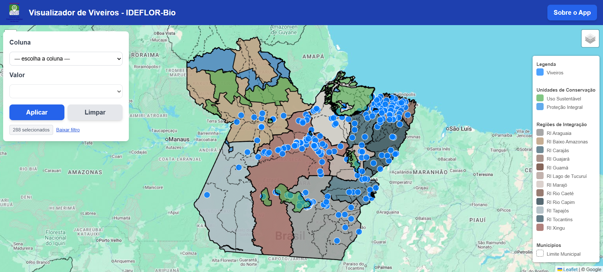
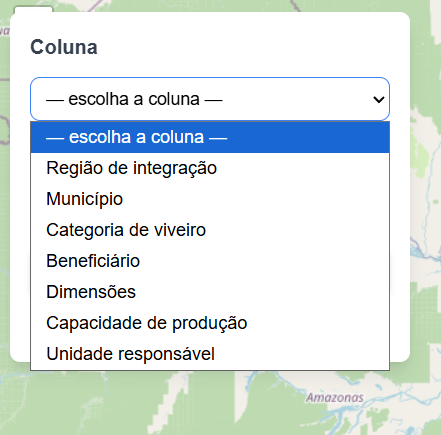
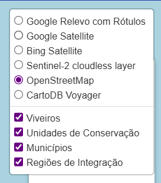

# Visualizador de Viveiros - IDEFLOR-Bio

Este é um mapa web interativo para a visualização e pesquisa de viveiros cadastrados, bem como a área de municípios e Unidades de Conservação no Pará. Desenvolvido para atender a uma demanda interna do IDEFLOR-Bio, este aplicativo facilita a análise de dados geoespaciais de forma simples e intuitiva.

## Funcionalidades Principais

* **Visualização Multicamadas**: Visualize diferentes conjuntos de dados no mapa, como viveiros, municípios, Unidades de Conservação e regiões de integração.
* **Filtro por Atributos**: Filtre os viveiros por atributos específicos, como "Município", "Categoria de viveiro", "Beneficiário" e outros. A interface de filtro é dinâmica e intuitiva.
* **Legenda Dinâmica**: A legenda se ajusta automaticamente para mostrar apenas as camadas que estão visíveis no mapa.
* **Contador e Download de Dados**: Acompanhe o número de viveiros selecionados pelo filtro e baixe o conjunto de dados filtrado em formato GeoJSON.
* **Múltiplos Mapas Base**: Escolha entre diferentes mapas base, como Google Satellite, OpenStreetMap e outros, para contextualizar as informações.

## Screenshots

### Visão Geral do Aplicativo
Uma visão completa da interface, mostrando o mapa com todas as camadas ativas, o painel de filtro e a legenda.



### Painel de Filtros
Exemplo de uso do filtro para selecionar uma coluna e seus respectivos valores para pesquisa.



### Controle de Camadas
Controle de camadas onde é possível ligar e desligar as camadas de dados (Viveiros, UC's, etc.) e alterar o mapa base.



## Como Acessar

O aplicativo está hospedado no GitHub Pages. Você pode acessá-lo diretamente pelo link:

**Link do Aplicativo**: [https://samuel-c-santos.github.io/viveiros-ideflorbio/](https://samuel-c-santos.github.io/viveiros-ideflorbio/)

## Tecnologias Utilizadas

* **[Leaflet](https://leafletjs.com/)**: Biblioteca JavaScript de código aberto para mapas interativos otimizada para dispositivos móveis.
* **[Tailwind CSS](https://tailwindcss.com/)**: Framework de CSS para design rápido e consistente da interface.

---

### Desenvolvimento

O código-fonte do aplicativo está disponível neste repositório. Para executar localmente, basta clonar o repositório e abrir o arquivo `index.html` em seu navegador.

```bash
git clone [https://github.com/samuel-c-santos/viveiros-ideflorbio.git](https://github.com/samuel-c-santos/viveiros-ideflorbio.git)
cd viveiros-ideflorbio
# Abra o arquivo index.html em seu navegador
````

### Estrutura de Arquivos

```
/
├── demo/
│   ├── demo_geral.jpg
│   ├── demo_filtros.png
│   └── demo_camadas.png
├── data/
│   ├── municipios.geojson
│   ├── regioes_integracao.geojson
│   ├── ucs_estaduais.geojson
│   └── viveiros.geojson
├── index.html
└── logo_ngeo.png
```

-----

**Observação:** O processo de criação deste mapa web foi realizado para atender à demanda de produção de geoinformações do processo **2025/2460154 / IDEFLORBIO**.

**Desenvolvido por**: [Samuel Santos](https://samuel-c-santos.github.io/)
